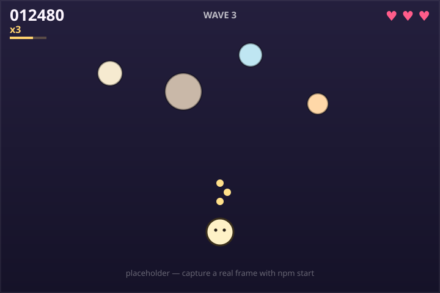

# ChikuRu 🎯

A browser arcade shooter, built as the **term project for ENG COMMU**. The
repository is also a worked example of collaborating in English inside a shared
codebase: the work was cut into weekly **sprints**, tasks were handed out as
**GitHub Issues**, and every change landed through a reviewed **Pull Request**.

> **Gameplay:** cute blob enemies rush your character from the top of the
> screen. **Shoot them for points.** If one reaches you it costs a **heart** —
> lose all three and it's game over. Chain kills without getting hit to build a
> **combo multiplier** (up to ×5). Waves get faster and meaner the longer you
> last.



<sub>Placeholder mock. Drop a real capture at `docs/screenshot.png` and point
this link at it.</sub>

## Play it

Plain HTML + ES modules — it just needs to be served over HTTP:

```bash
npm start                 # static server on http://localhost:8080
# or: python3 -m http.server 8080
```

Add `?debug` to the URL for an fps / wave / entity overlay.

## Controls

| Action | Keyboard / Mouse | Touch |
| --- | --- | --- |
| Move | `WASD` or arrow keys | drag |
| Aim | mouse | — (fires upward) |
| Shoot | hold `Space` or the mouse button | tap / hold |
| Pause | `P` (also on focus loss) | — |
| Mute | `M` | — |
| Start / restart | `Enter` or click | tap |

## How it's built

No framework, no bundler. `src/game.js` is a thin orchestrator; behaviour lives
in small modules that talk over an event bus.

```
src/
├── main.js            boot: viewport + loop + asset/audio load
├── game.js            state machine + wiring
├── config.js          every tunable number (see docs/BALANCE.md)
├── core/              viewport (DPI + letterbox), fixed-timestep loop
├── input.js           keyboard / mouse / touch
├── entities/          player, bullet, enemy, particle  (all pooled)
├── systems/           spawner, waves, collision, scoreboard, combo, effects
├── ui/                hud, menu, screens
├── audio.js           WebAudio synth (no audio files)
├── assetLoader.js     optional sprites, procedural fallback
└── storage.js         namespaced localStorage (best score, mute)
```

Run the checks:

```bash
npm run lint            # ESLint
npm test                # headless smoke test — runs the real loop for 30 s
```

## The collaboration side (ENG COMMU)

- [`docs/PROJECT_CHARTER.md`](docs/PROJECT_CHARTER.md) — scope, roles,
  communication norms
- [`docs/SPRINT_PLAN.md`](docs/SPRINT_PLAN.md) — the four sprints and the backlog
- [`docs/sprints/`](docs/sprints/) — per-sprint working notes + standup logs
- [`docs/retrospectives/`](docs/retrospectives/) — keep / drop / try
- [`docs/DECISIONS.md`](docs/DECISIONS.md) — lightweight architecture decision records
- [`CHANGELOG.md`](CHANGELOG.md) — what shipped in each version, tagged by issue
- [`docs/DEMO_SCRIPT.md`](docs/DEMO_SCRIPT.md) — the 3-minute class walkthrough
- [`CONTRIBUTING.md`](CONTRIBUTING.md) — branch / commit / PR workflow

## Assets & licensing

No official *Chiikawa* artwork or audio is in this repository. Everything under
`assets/sprites/` is original placeholder art; sound is generated at runtime.
"Chiikawa" (ちいかわ) and its characters belong to Nagano / their rights
holders. See [`assets/CREDITS.md`](assets/CREDITS.md) to swap in your own images
locally. Code is [MIT](LICENSE).
